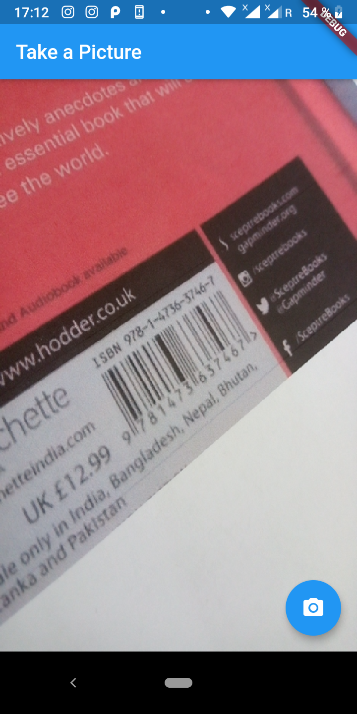

# Books_finder :blue_book:
a flutter app to get books info and reviews from good reads by taking the isbn code photo using firebase machine learning kit 


## what you need to do before running the app : 
- Create a firebase app and connect it with ml-kit and downlod the goodle-config json file and add to /android/app
- Create a GoodReads developper account and copy the API key and past it :
**/lib/utils.dart**
```
Future <Book> get_review(String imagePath) async {
    var info = new List<String>();
    String isbn = await decode(imagePath);
    //print(isbn);
    String url = "https://www.goodreads.com/book/isbn?FORMAT=json&key=[###your goodreads API here###]&isbn=" + isbn;
    final response = await http.get(url);
    var book = new Book(" "," "," "," "," "," "," ");
    if (response.statusCode == 200) {

```
- make sure you installed flutter.

## how it works : 
<p align = 'center'>
  
  
</p>

## TO DO  :
- [ ] Enhance the api calls and the layout.
- [ ] extract the book info from other sources like google book and amazon books.
- [ ] add more option like consulting similar books/ recommended books.
